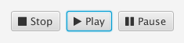

*Font Awesome by Dave Gandy: http://fontawesome.io/*

Font Awesome gives you scalable vector icons that can instantly be customized —
size, color, drop shadow, and anything that can be done with the power of CSS.

This library provides a bundled version of these fonts that can easily be used in your Java/JavaFX-based applications.



A compiled and ready-to-use version of this library can be found in the
Sonatype OSS Maven Repository (oss.sonatype.org). To use the library
in your Maven based projects just add the following lines to your
'pom.xml':

```xml
<dependency>
  <groupId>com.cathive.fonts</groupId>
  <artifactId>fonts-awesome</artifactId>
  <version>${fonts-awesome.version}</version>
</dependency>
```

You can directly use the FontAwesome icons in your JavaFX application.
Use instances of `com.cathive.fonts.FontAwesomeIconView` — either construct
them programatically or embed them into your FXML sources:

```xml
<?xml version="1.0" encoding="UTF-8"?>
<!--
  This example shows three different buttons (stop, play and pause)
  whose graphic components (icons) are rendered using the FontAwesome
  icons.
  -->
<?import javafx.scene.control.Button?>
<?import javafx.scene.layout.HBox?>
<?import com.cathive.fonts.fontawesome.FontAwesomeIconView?>
<HBox xmlns:fx="http://javafx.com/fxml">
  <children>
    <Button text="Stop">
      <graphic>
        <FontAwesomeIconView icon="ICON_STOP"/>
      </graphic>
    </Button>
    <Button text="Play">
      <graphic>
        <FontAwesomeIconView icon="ICON_PLAY"/>
      </graphic>
    </Button>
    <Button text="Pause">
      <graphic>
        <FontAwesomeIconView icon="ICON_PAUSE"/>
      </graphic>
    </Button>
  </children>
</HBox>
```
